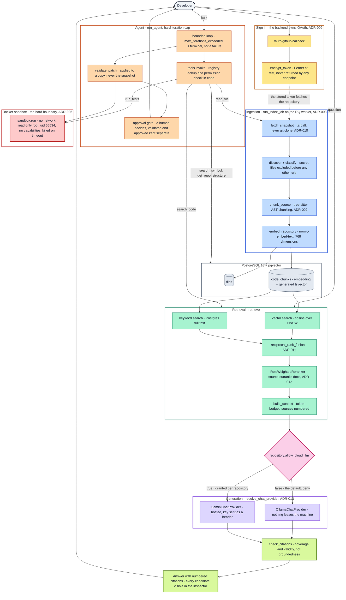

# AI Software Engineering Platform

An AI-powered developer platform that connects to a GitHub repository,
understands the codebase using retrieval-augmented generation, and uses an agent
to help with real software engineering tasks: answering questions about the
code, investigating bugs, running tests safely in a sandbox, and proposing
patches for human approval.

> ### Current status: Stage 1 complete
>
> Ingestion, retrieval, the evaluation harness, the inspector, the agent loop,
> the Docker sandbox and the patch approval gate are all built and tested, and
> every push runs the full gate in CI.
>
> Retrieval is **measured and inspectable**: 40 labelled questions across a
> tuning and a held-out set, and a UI showing every candidate with the scores
> behind its rank. Role-weighted reranking is the largest measured gain in the
> project: on the held-out set it lifts R@5 from 0.643 to **0.786** and MRR from
> 0.607 to **0.702**. `GET /evaluations` serves that exact run, on the held-out
> set — written before any tuning and used only for confirmation.
>
> **Answer quality is a function of the model, and the model is now
> selectable.** Chat and the agent run behind a `ChatProvider` interface, so the
> same pipeline can be pointed at a local Ollama model or a hosted one
> ([ADR-013](docs/adr/ADR-013-cloud-llm-provider.md)). Changing only the model,
> measured over identical questions in one process:
>
> | | `qwen2.5-coder:3b` (local) | `gemini-3.6-flash` |
> | --- | --- | --- |
> | Answers citing a source | 1 of 3 | **3 of 3** |
> | Mean citation coverage | 0.167 | **0.933** |
>
> So cited answers work on a capable model and remain unreliable on one that
> fits in 7.7 GB. The agent's guardrails, sandbox and traces work regardless;
> its *decisions* are poor on the local model and unmeasured on a hosted one,
> which is stated rather than glossed.
>
> **Repository content is not sent to a hosted model without consent.** The
> permission is per repository, defaults to deny, and a repository that has not
> opted in is answered locally with the downgrade stated in the response
> ([`docs/security.md`](docs/security.md)).
>
> [`docs/README.md`](docs/README.md) tracks exactly what is built, what is
> verified, and what remains. Nothing is described as working until it has
> actually been run — including the parts that did not work.

## How it works

Every box is a real module or function in this repository, and every arrow is a
call that exists. Nothing here is aspirational — the parts that are *not* built
are named in the status table above, not drawn.



Three things the diagram is drawn to make visible, because they are the design
decisions rather than the plumbing:

**Consent sits between retrieval and generation, not in configuration.**
`resolve_chat_provider` takes the repository's permission as an argument, so
there is no path from a question to a hosted model that skips it. A repository
that has not opted in is answered locally and told so.

**The sandbox is reached only by the two paths that execute code** — `run_tests`
and patch validation. Everything else the agent can do is a database read or a
file read inside a snapshot.

**Retrieval is shared.** The agent's `search_code` calls the same `retrieve`
the chat path uses, so an improvement to ranking benefits both and is measured
once.

## Architecture

| Layer | Technology |
| --- | --- |
| Frontend | Next.js 16, React 19, TypeScript (strict), Tailwind |
| Backend | FastAPI, Python 3.11, SQLAlchemy 2, Pydantic v2 |
| Database | PostgreSQL 16 + pgvector |
| Queue | Redis + RQ (ADR-003) |
| Parsing | tree-sitter, AST-aware chunking (ADR-002) |
| Embeddings | Ollama — `nomic-embed-text`, 768-dim, pgvector + HNSW |
| Retrieval | Hybrid: pgvector cosine + Postgres full-text, RRF-fused (ADR-011) |
| Reranking | Role-weighted, path-based (ADR-012) |
| LLM | Selectable: Ollama (local) or Gemini, behind one `ChatProvider` (ADR-013) |
| Auth | GitHub OAuth, backend-owned; signed HttpOnly session cookie |
| Sandbox | Docker, isolated per run (ADR-006) |
| CI | GitHub Actions — lint, types, unit, integration, sandbox, frontend build |

Design documents and architecture decision records live in [`docs/`](docs/).
Start with [`docs/hld.md`](docs/hld.md), or
[`docs/DEMO.md`](docs/DEMO.md) for a five-minute walkthrough of what to look at
and in what order.

## Prerequisites

- **Python 3.11** — pinned; see [deployment notes](docs/deployment.md) for why
- **Node.js 20+**
- **Docker Desktop**, running
- **Ollama** running, with `nomic-embed-text` pulled — required for indexing:
  ```bash
  ollama pull nomic-embed-text     # embeddings — always local, always required
  ollama pull qwen2.5-coder:3b     # generation, if you are not using a hosted model
  ```
  Embeddings always run locally, whichever chat provider is configured: a stored
  vector is only comparable to others from the same model, so changing that
  provider would mean re-embedding the corpus rather than flipping a setting.

## Setup

### 1. Register a GitHub OAuth App

Sign-in needs your own OAuth App — at
<https://github.com/settings/developers> → **New OAuth App**:

| Field | Value |
| --- | --- |
| Homepage URL | `http://localhost:3000` |
| Authorization callback URL | `http://localhost:8000/auth/github/callback` |

The callback URL must match exactly: the backend owns the OAuth flow
([ADR-009](docs/adr/ADR-009-backend-owned-github-oauth.md)), so it is *not* the
NextAuth path. Copy the Client ID and generate a client secret; both go into
`.env` below.

### 2. Everything else

```bash
# Configuration
cp .env.example .env

# Fill in GITHUB_CLIENT_ID and GITHUB_CLIENT_SECRET from the OAuth App above,
# then generate the two secrets (both must be at least 32 characters):
openssl rand -base64 32       # -> NEXTAUTH_SECRET
openssl rand -base64 32       # -> TOKEN_ENCRYPTION_KEY

# Optional: a hosted model for chat and the agent. Left unset, everything runs
# on the local Ollama model and no repository content leaves the machine.
#   LLM_PROVIDER=gemini
#   GEMINI_API_KEY=...        # from https://aistudio.google.com/apikey
# Setting these grants nothing on its own: each repository must be opted in
# separately, and the free tier allows 20 requests per day per model.

# Infrastructure
docker compose up -d          # postgres + pgvector, redis

# Backend
cd backend
py -3.11 -m venv .venv                    # Windows; use python3.11 elsewhere
./.venv/Scripts/python.exe -m pip install -e ".[dev]"
./.venv/Scripts/python.exe -m alembic upgrade head
./.venv/Scripts/python.exe -m uvicorn app.main:app --reload

# Frontend (in a second terminal)
cd frontend
npm install
npm run dev

# Ingestion and agent worker (in a third terminal)
cd backend
./.venv/Scripts/python.exe -m app.workers.run_worker

# Sandbox image — required for running tests and validating patches
docker build -f docker/sandbox.Dockerfile -t aisep-sandbox:latest .
```

Without the worker running, indexing jobs queue and stay `queued`. Everything
else works. `GET /health` reports Ollama alongside Postgres and Redis, so a
missing model shows up there rather than only when a job fails.

### 3. Choosing where answers are generated

Out of the box everything runs locally. Answers will be weak — the models that
fit on a typical laptop cite unreliably, which is measured rather than assumed
(see [`docs/README.md`](docs/README.md)).

To use a hosted model, set `LLM_PROVIDER` and `GEMINI_API_KEY`, then opt in the
specific repositories whose code may be sent:

```bash
curl -X PATCH http://localhost:8000/repositories/<id>/settings   -H "Content-Type: application/json" -b "aisep_session=<cookie>"   -d '{"allow_cloud_llm": true}'
```

or use the toggle on the repository row. Configuration says which provider is
*available*; the repository says whether it may be *used*, and only the
repository can say no. A repository that has not opted in is answered by the
local model, with the downgrade stated in the answer rather than hidden.

Then open <http://localhost:3000>. The page shows live backend and dependency
status, and a **Sign in with GitHub** button. After signing in you land on
`/repositories`, where you can connect the repositories this platform may read,
then **Index** one — the progress shown is reported by the worker, not
simulated. Indexing parses the repository and embeds every chunk; the row then
shows real file, chunk and embedded counts. Once a repository has embeddings, a
search box appears: every result shows whether the vector side, the keyword
side, or both found it, and what each scored it.
<http://localhost:8000/docs> has the interactive API reference.

Without `GITHUB_CLIENT_ID` and `GITHUB_CLIENT_SECRET` the rest of the
application still runs; only sign-in is unavailable, and it says so rather than
failing silently.

To confirm the health reporting is real rather than cosmetic, stop a dependency
and reload the page:

```bash
docker compose stop redis     # page shows "Degraded" + ConnectionError
docker compose start redis    # recovers
```

## Security notes

- The GitHub access token is stored encrypted (`TOKEN_ENCRYPTION_KEY`), is never
  returned by any endpoint, and never reaches the browser.
- The session cookie is HttpOnly and signed; its algorithm and issuer are pinned
  at verification.
- Only read scopes are requested: `read:user user:email repo`. Stage 1 performs
  no GitHub writes.
- Rotating `TOKEN_ENCRYPTION_KEY` invalidates every stored token — users simply
  sign in again.
- Secret-bearing files (`.env`, private keys, credentials) are excluded from
  indexing before any other rule is applied, so they are never parsed, never
  stored, and can never be quoted back by the LLM. Repository archives are
  treated as untrusted input: extraction rejects path traversal and escaping
  symlinks, and both download and expanded size are bounded.

- **No repository content reaches a hosted model without that repository's
  consent.** The permission defaults to deny, is granted per repository through
  one owner-scoped endpoint, and is recorded with a timestamp. A denied
  repository is answered locally rather than refused — refusing would pressure
  people into granting permission to get their tool working, which is consent
  extracted by obstruction.
- A hosted provider's API key is held as a `SecretStr`, sent as a request header
  and never in a URL, so it cannot leak through proxy logs or the text of a
  timeout exception.

See [`docs/security.md`](docs/security.md) for the full model.

## Development

```bash
# Backend — from backend/
./.venv/Scripts/python.exe -m ruff check .        # lint
./.venv/Scripts/python.exe -m mypy               # types (strict; app, eval, tests)
./.venv/Scripts/python.exe -m pytest              # all tests
./.venv/Scripts/python.exe -m pytest -m "not integration"   # no services needed
./.venv/Scripts/python.exe -m pytest -m llm                 # needs Ollama running
./.venv/Scripts/python.exe -m eval                          # retrieval benchmark
./.venv/Scripts/python.exe -m eval.agent_cli                # agent benchmark
./.venv/Scripts/python.exe -m eval.citation_probe           # citations, per provider
./.venv/Scripts/python.exe -m alembic check       # models vs migrations

# Frontend — from frontend/
npx tsc --noEmit
npm run lint
npm run build
```

Integration tests need `docker compose up -d` and a database migrated to head.
Sandbox tests additionally need the `aisep-sandbox:latest` image built.

The same gate runs in CI on every push and pull request
([`.github/workflows/ci.yml`](.github/workflows/ci.yml)): lint, types, unit
tests, `alembic upgrade` and `alembic check`, integration tests, the sandbox
suite against a freshly built image, and the frontend build. Tests marked `llm`
are excluded there — nothing in CI exercises a live model, which is a real gap
and is stated rather than implied.

> **VS Code tip:** select `backend/.venv` as the Python interpreter, otherwise
> the editor reports imports as unresolved even though the venv is correct.

## Project layout

```
backend/     FastAPI application, workers, migrations, tests, evaluation
frontend/    Next.js application
docs/        HLD, LLD, API, database, RAG, agents, security, ADRs
docker-compose.yml
```

## Principles

- **No fake implementations.** No hardcoded AI answers, no fabricated metrics,
  no placeholder passed off as production-ready. Unfinished work is labelled.
- **Every technology solves a stated problem.** Kafka, Kubernetes and AWS are
  deferred to Stage 3, each with an ADR recording the problem it addresses.
- **Evaluate from day one.** Retrieval quality is measured against a labelled
  benchmark, and the suite is re-run whenever retrieval logic changes.
- **Security by default.** Repository content is untrusted data; AI-generated
  code executes only inside an isolated sandbox.
